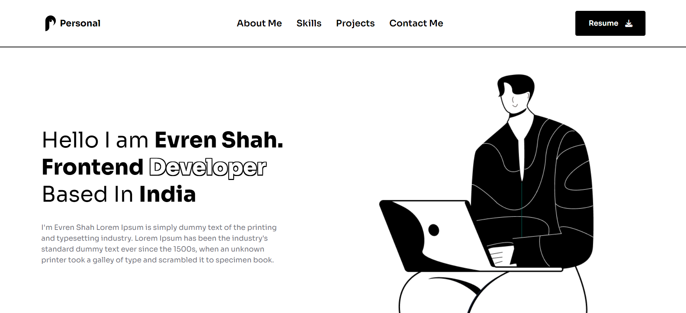

    <h1>Personal is a portfolio-website</h1>

Click to github pages to see the website!!!

<a href="https://www.figma.com/community/file/1318529372146880502/illustration-based-portfolio-website-template">Link of layout template (im not a creator of this template!)</a>